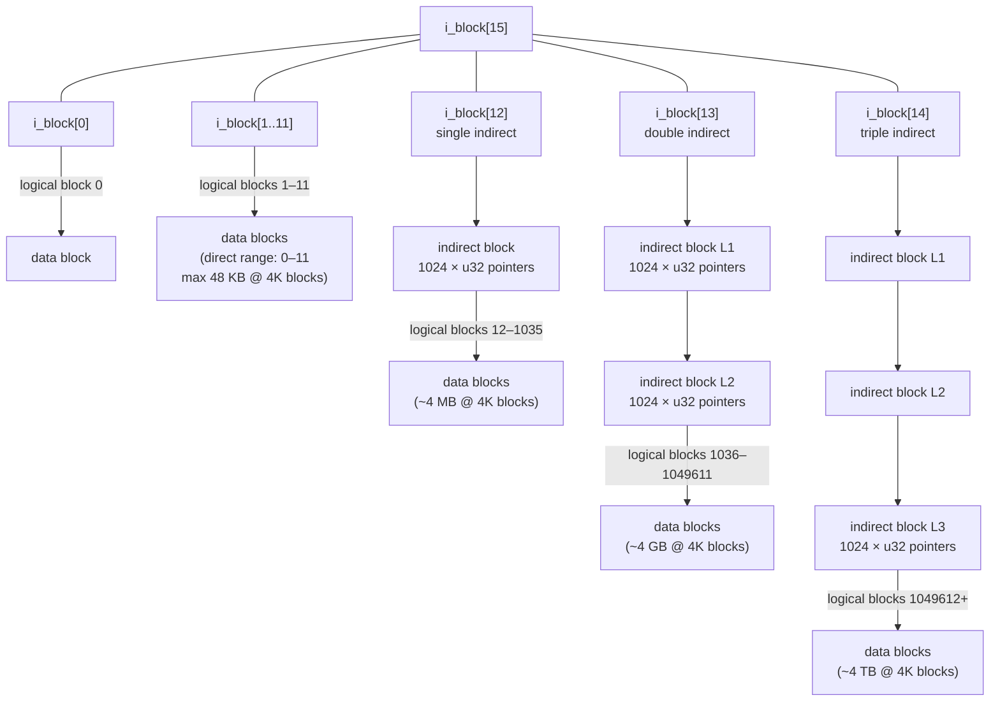

# ext2 Data Structures

A conceptual guide to the entities that make up an ext2 filesystem, where they live on
disk, and how they reference each other. For field-level detail see `ext2-ondisk-format.md`.

---

## Volume Layout

The disk is divided into fixed-size **block groups**. Every group has the same structure.
The superblock and group descriptor table (GDT) appear at the start of the volume; each
group contains its own bitmap and inode table followed by data blocks.

```
Byte 0        1024       2048              block_size * blocks_per_group
│             │          │                 │
▼             ▼          ▼                 ▼
┌─────────────┬──────────┬─────────────────┬─────────────────┬─────────────────┐
│  Boot Block │Superblock│      GDT        │   Block Group 0 │   Block Group 1 │ ...
│  (1024 B)   │(1024 B)  │(32 B × ngroups) │                 │                 │
└─────────────┴──────────┴─────────────────┴─────────────────┴─────────────────┘
```

- The **boot block** (bytes 0–1023) is reserved and never used by ext2.
- The **superblock** is always at byte offset 1024 regardless of block size.
- The **GDT** immediately follows: at byte 2048 for 1 KB blocks, at byte `block_size`
  for larger blocks. Each entry is 32 bytes.
- Block groups are contiguous and equal-sized. The last group may be smaller.

---

## Block Group Layout

Each block group contains, in order:

```
┌──────────────┬──────────────┬──────────────────────────────┬──────────────────┐
│ Block Bitmap │ Inode Bitmap │        Inode Table           │   Data Blocks    │
│  (1 block)   │  (1 block)   │ (inode_size × inodes_per_    │                  │
│              │              │  group / block_size blocks)  │                  │
└──────────────┴──────────────┴──────────────────────────────┴──────────────────┘
  bg_block_bitmap  bg_inode_bitmap    bg_inode_table
  (absolute block number, read from GDT entry)
```

- **Block bitmap**: one bit per block in the group. 1 = allocated, 0 = free.
- **Inode bitmap**: one bit per inode slot in the group. 1 = allocated, 0 = free.
- **Inode table**: array of fixed-size inode records. The size of each record is read
  from the superblock (`s_inode_size`; always 128 for revision 0 filesystems).
- **Data blocks**: everything else — file content, directory entries, indirect pointer
  blocks.

The block numbers stored in the GDT (`bg_block_bitmap`, `bg_inode_bitmap`,
`bg_inode_table`) are **absolute** filesystem block numbers, not group-relative.

---

## Entity Relationships

```mermaid
graph TD
    SB[Superblock<br/>byte 1024<br/>────────────<br/>inodes_count<br/>blocks_count<br/>block_size<br/>inodes_per_group<br/>blocks_per_group<br/>inode_size]

    GDT[Group Descriptor Table<br/>────────────<br/>one entry per group]

    GD[Group Descriptor<br/>────────────<br/>bg_block_bitmap<br/>bg_inode_bitmap<br/>bg_inode_table<br/>free_blocks_count<br/>free_inodes_count]

    BB[Block Bitmap<br/>1 bit per block]
    IB[Inode Bitmap<br/>1 bit per inode]
    IT[Inode Table<br/>array of inodes]
    IN[Inode<br/>────────────<br/>i_mode, i_size<br/>i_links_count<br/>i_block[15]]
    DB[Data Block<br/>file content or<br/>directory entries]

    SB -->|"num_groups() tells how many"| GDT
    GDT -->|"one entry"| GD
    GD -->|bg_block_bitmap| BB
    GD -->|bg_inode_bitmap| IB
    GD -->|bg_inode_table| IT
    IT -->|"indexed by inode_number"| IN
    IN -->|"i_block[] pointers"| DB
```

---

## Inode Lookup

Given an inode number (1-based):

```
group       = (inode_num - 1) / inodes_per_group
local_index = (inode_num - 1) % inodes_per_group

inode_table_block = groups[group].inode_table
block_within_table = local_index / (block_size / inode_size)
offset_within_block = (local_index % (block_size / inode_size)) * inode_size

sector = (inode_table_block + block_within_table) * block_size / 512
```

---

## Block Pointer Tree

An inode's `i_block[15]` array maps logical block indices to physical block numbers.
The first 12 entries are direct; the remaining three are indirect at increasing depths.



Resolving logical block index `N` to a physical block number:

| Range | Depth | Formula |
|-------|-------|---------|
| 0–11 | direct | `i_block[N]` |
| 12–1035 | single | read `i_block[12]`, then pointer at `(N-12) * 4` |
| 1036–1049611 | double | read `i_block[13]`, L1 at `((N-1036) / 1024) * 4`, L2 at `((N-1036) % 1024) * 4` |
| 1049612+ | triple | three levels of indirection |

---

## Directory Entries

A directory inode's data blocks contain a packed sequence of variable-length records.
There is no index — readers scan linearly from the start.

```
┌────────────────────────────────────────────────────────────────────┐
│                         Data Block                                 │
│                                                                    │
│  ┌──────────────────────┐  ┌──────────────────────┐               │
│  │ inode    (4 B)       │  │ inode    (4 B)        │  ...          │
│  │ rec_len  (2 B) ──────┼─►│ rec_len  (2 B)        │               │
│  │ name_len (1 B)       │  │ name_len (1 B)        │               │
│  │ file_type(1 B)       │  │ file_type(1 B)        │               │
│  │ name[name_len]       │  │ name[name_len]        │               │
│  │ padding to 4-byte    │  │ padding to 4-byte     │               │
│  └──────────────────────┘  └──────────────────────┘               │
│                                                                    │
│  Last entry's rec_len reaches the end of the block.               │
│  Deleted entries have inode == 0 but rec_len is still valid        │
│  (space absorbed into the preceding entry's rec_len).             │
└────────────────────────────────────────────────────────────────────┘
```

---

## Path Resolution

How the kernel walks from a path string to file data:

```mermaid
graph LR
    PATH["path string<br/>/mnt/subdir/file.txt"]
    MOUNT["mount table<br/>find superblock for /mnt"]
    ROOT["root inode #2<br/>from superblock"]
    LOOKUP1["lookup 'subdir'<br/>scan root dir entries"]
    INODE2["inode for subdir<br/>type = Directory"]
    LOOKUP2["lookup 'file.txt'<br/>scan subdir entries"]
    INODE3["inode for file.txt<br/>type = RegularFile"]
    BLOCKS["resolve i_block[]<br/>direct / indirect"]
    DATA["data blocks<br/>file content"]

    PATH --> MOUNT
    MOUNT --> ROOT
    ROOT --> LOOKUP1
    LOOKUP1 -->|"inode number found<br/>in dir entry"| INODE2
    INODE2 --> LOOKUP2
    LOOKUP2 -->|"inode number found<br/>in dir entry"| INODE3
    INODE3 --> BLOCKS
    BLOCKS --> DATA
```



---

## Free Space Accounting

Free space is tracked at two levels, and both must stay consistent:

| Location | Fields | Scope |
|----------|--------|-------|
| Superblock | `s_free_blocks_count`, `s_free_inodes_count` | Whole filesystem totals |
| Each GDT entry | `bg_free_blocks_count`, `bg_free_inodes_count` | Per-group counts |
| Block bitmap | one bit per block | Ground truth for blocks |
| Inode bitmap | one bit per inode slot | Ground truth for inodes |

The bitmaps are the authoritative source. The counts in the superblock and GDT are
cached summaries — they must equal what a full bitmap scan would produce. An fsck
verifies this by scanning the bitmaps and comparing against the stored counts.
